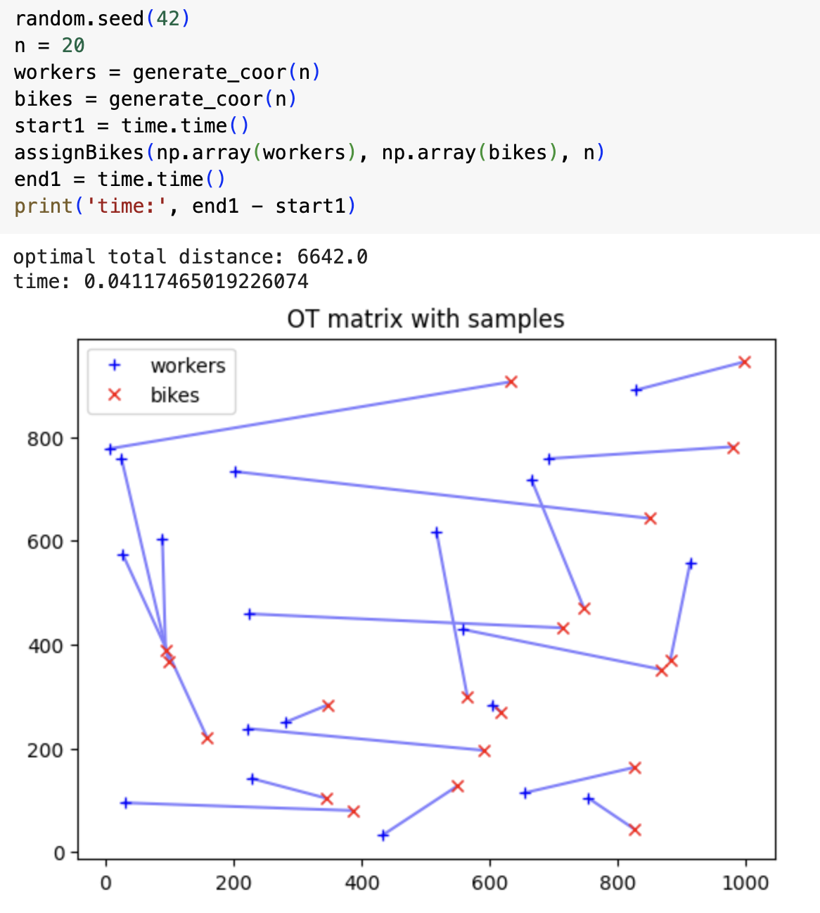

# Optimal Transport I

[Problem 629](https://leetcode.com/problems/k-inverse-pairs-array/): Given a positive integer `n` and `k`, how many permutations of `1` to `n` have exactly `k` inversions?

## What is the inversion count of a permutation?
An inversion in a permutation is a pair `(i,j)` such that `1 ≤ i ≤ n` and `p[i]>p[j]`. The number of such inversion pairs in a permutation is called its inversion count. This concept is fundamental in algebra, used in defining determinants and in the symmetric group to classify permutations as either odd or even based on their inversion counts.

## Approach to Solve the Problem
For this Leetcode problem, we can use a bottom-up dynamic programming approach. Any permutation of length `n` can be derived by inserting the number `n` into a permutation of length `n−1`. The key is to find the recurrence relation from `n−1` to `n`. Let `f(n,k)` represent the number of permutations of length `n` with exactly `k` inversions. The recurrence relation is:
```
f(n,k)=f(n−1,k)+f(n−1,k−1)+…+f(n−1,k−n+1)
```

The following can be derived:
```
f(n,k)=f(n−1,k)+f(n,k−1)−f(n−1,k−n)
```

The corresponding code is shown in the first figure. Note that for a permutation of length `n`, the range of inversion counts is from 0 to `n(n−1)/2`.

In a more complex example (`n = 20`) below, the optimal transport algorithm takes 0.04 seconds, while dynamic programming requires 12.9 seconds.


[back](/math-and-algo)
