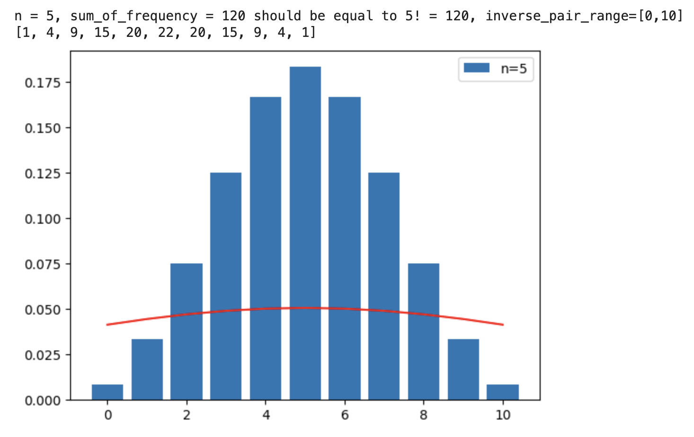
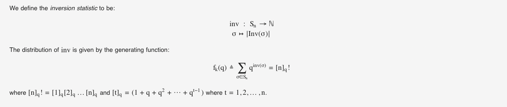

# Inversion I: The Distribution

[Problem 629](https://leetcode.com/problems/k-inverse-pairs-array/): Given a positive integer `n` and `k`, how many permutations of `1` to `n` have exactly `k` inversions?

## What is the inversion count of a permutation?
An [inversion](https://en.wikipedia.org/wiki/Inversion_(discrete_mathematics)) in a permutation is a pair `(i,j)` such that `1 ≤ i ≤ n` and `p[i] > p[j]`. The number of such inversion pairs in a permutation is called its inversion count. This concept is fundamental in algebra, used in defining determinants and in the symmetric group to classify permutations as either odd or even based on their inversion counts.

## Approach to Solve the Problem
For this Leetcode problem, we can use a bottom-up dynamic programming approach. Any permutation of length `n` can be derived by inserting the number `n` into a permutation of length `n − 1`. The key is to find the recurrence relation from `n − 1` to `n`. Let `f(n,k)` represent the number of permutations of length `n` with exactly `k` inversions. The recurrence relation is:
```
f(n,k) = f(n−1,k) + f(n−1,k−1) + … + f(n−1,k−n+1)
```

The following can be derived:
```
f(n,k) = f(n−1,k) + f(n,k−1) − f(n−1,k−n)
```

The corresponding code is below. Note that for a permutation of length `n`, the range of inversion counts is from 0 to `n(n−1)/2`.
```python
def kInversePairs(self, n: int, k: int) -> int:
    MOD = 10 ** 9 + 7
    curr = [0 for _ in range(k + 1)]
    curr[0] = 1
    for l in range(2, n + 1):
        last = curr
        curr = [0 for _ in range(k + 1)]
        curr[0] = 1
        for inv in range(1, min(l * (l - 1) // 2 + 1, k + 1)):
            if inv - l >= 0:
                curr[inv] = (last[inv] + curr[inv - 1] - last[inv - l]) % MOD
            else:
                curr[inv] = (last[inv] + curr[inv - 1]) % MOD
    return curr[-1]
```

## Distribution of Inversion Counts
A natural question arises: what is the distribution of inversion counts for all permutations of length `n`? Using the above algorithm, we can count the occurrences of each inversion count and plot the distribution. The corresponding code is shown below. (The code and the plots below can be found in this [colab notebook](https://colab.research.google.com/drive/1TOAh7lO_uWzYaE9ErsC4xVnTe9qiNnlB#scrollTo=AkG1Q8HD5X1n)) 
```python
# find inverse pairs distribution for all permuatation of lengths 1 to n
def inv_distribution(n):
  ans = [[1]] # n = 1, only one permutation with 0 inverse pairs
  largest_inv = 0
  for i in range(2, n + 1):
    largest_inv += i - 1
    curr = [0 for _ in range(largest_inv + 1)]
    curr[0] = 1
    for inv_cnt in range(1, largest_inv + 1):
      tmp = curr[inv_cnt - 1]
      if len(ans[-1]) >= inv_cnt + 1:
        tmp += ans[-1][inv_cnt]
      if inv_cnt - i >= 0:
        tmp -= ans[-1][inv_cnt - i]
      curr[inv_cnt] = tmp
    ans.append(curr)
  return ans

def print_distribution(n, plot=False):
  ans = inv_distribution(n)
  for k in range(n):
    print(f"\nn = {k + 1}, sum_of_frequency = {sum(ans[k])} should be " \
          f"equal to {k + 1}! = {math.factorial(k + 1)}, inverse_pair_range" \
          f"=[0,{len(ans[k])-1}]")
    print(ans[k])

    if plot and k > 3:
      # fig, ax = plt.subplots(tight_layout=True)
      x_axis = range(len(ans[k]))
      dist = np.array(ans[k])

      # Calculating mean and standard deviation
      mean = (len(ans[k]) - 1) / 2.0
      sd = statistics.stdev(dist)

      dist = dist / np.sum(dist)
      hist = plt.bar(x_axis, dist, label="n="+str(k+1))

      plt.plot(x_axis, norm.pdf(x_axis, mean, sd), 'r')
      plt.legend()
      plt.show()
```

And the distributions for `n=5,6,7` are shown in figures below.



It can be observed that the distribution resembles a normal distribution, but there are significant differences. The red curve in the figures represents the normal distribution.

In fact, the distribution of inversion counts can be described using a generating function.


For a detailed proof, refer to this blog post titled "[Inductive proof of the inversion statistics distribution on permutation set](https://www.tvhoang.com/articles/2021/03/inversion-stat-distribution-proof)". (The genrating function above is also extracted from the post)

[back](/math-and-algo)
